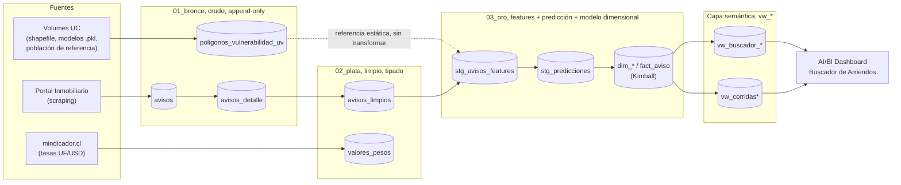

# gran-concepcion-databricks


## Descripción
Pipeline de Databricks que replica, capa por capa, el proyecto de scraping y
modelo de precios de arriendo del Gran Concepción: scraping de avisos,
limpieza, ingeniería de variables y predicción de precio, siguiendo la
arquitectura medallón de 3 capas (bronce, plata, oro), más una capa semántica
de vistas de consumo sobre Oro.

## Índice
- [Arquitectura](#arquitectura)
- [Stack técnico](#stack-técnico)
- [Dataset y fuente](#dataset-y-fuente)
- [Cómo cumple el estándar medallón](#cómo-cumple-el-estándar-medallón)
- [Decisiones técnicas](#decisiones-técnicas)
- [Estructura del proyecto](#estructura-del-proyecto)
- [Volumes necesarios](#volumes-necesarios)
- [Uso](#uso)
- [Requisitos](#requisitos)

## Arquitectura



Cada capa vive en su propio schema de Unity Catalog
(`gran_concepcion.01_bronce`, `.02_plata`, `.03_oro`). La predicción de
precio vive **dentro** de Oro (no es una 4ª capa aparte): Oro es el layer de
negocio completo, features + predicción/etiqueta lista para consumo. La
capa semántica (vistas `vw_*`) tampoco es una 4ª capa medallón: es la capa de
consumo estándar (Kimball) entre Gold y el dashboard, sin tablas propias ni
lógica de negocio nueva.

## Stack técnico

| Categoría | Tecnología | Uso en el proyecto |
|---|---|---|
| Compute / orquestación | **Databricks Workflows** (Jobs), serverless | Job `gran_concepcion_pipeline`, 11 tareas encadenadas, cron cada 6h |
| Almacenamiento | **Delta Lake** sobre **Unity Catalog** (catalog `gran_concepcion`) | Tablas gobernadas por capa + 4 Volumes para archivos de carga manual |
| Procesamiento | **Apache Spark** (PySpark + Spark SQL) | Notebooks `.py` con celdas `spark.sql(...)` / `%sql`, sin geopandas/GDAL |
| Lenguajes | **Python**, **SQL** | Python para scraping/ML/geo, SQL para limpieza/features/modelo dimensional |
| Machine Learning | **scikit-learn** (Random Forest, imputación de superficie), **LightGBM** (ensamble de predicción de precio) | Modelos ya entrenados en el "proyecto original", se cargan con `joblib`/`pickle`, este repo no entrena |
| Geoespacial | **pyshp** + **shapely** | Cruce punto-en-polígono para vulnerabilidad socioterritorial, sin GDAL |
| Consumo / BI | **Databricks AI/BI Dashboards** (Lakeview) | Dashboard "Buscador de Arriendos - Gran Concepción" |
| IaC | **Databricks Asset Bundles** (`databricks.yml`) | Config del bundle; el Job en sí se gestiona vía Workflows UI (export en `05_Workflows/job_proyecto.yml`) |

## Dataset y fuente

- **Origen**: scraping propio de [Portal Inmobiliario](https://www.portalinmobiliario.com)
  (dos pasadas: grilla de resultados de búsqueda, luego detalle de cada
  aviso).
- **Qué representa**: avisos de **arriendo de departamentos** (el pipeline
  entero está acotado a `tipo_propiedad = "departamento"` y
  `operacion = "arriendo"`, no procesa casas ni ventas) en las **10 comunas
  del Gran Concepción**, Región del Biobío, Chile.
- **Enriquecimiento externo**: tasas históricas UF/USD desde
  [mindicador.cl](https://mindicador.cl) (para convertir precios publicados
  en otra moneda a CLP con la tasa vigente el día de publicación del aviso,
  no la más reciente), y polígonos IGVUST (índice de vulnerabilidad
  socioterritorial) cargados una vez desde un shapefile.
- **Volumen actual** (2026-09-17): **3.961 avisos** capturados en Bronce,
  **3.884** con detalle ya scrapeado, en **8 comunas** con avisos activos
  hasta ahora, acumulados desde el **2026-07-29** (~7 semanas de scraping
  corriendo cada 6h). Crece de forma incremental, nunca se reprocesan
  avisos ya vistos.

## Cómo cumple el estándar medallón

Además de organizar el código en carpetas por tipo de objeto y capa (ver
[Estructura del proyecto](#estructura-del-proyecto)), el pipeline implementa
los requisitos técnicos del patrón medallón (no solo la convención de
nombres):

| Requisito del estándar | Cómo se cumple acá |
|---|---|
| **Bronce append-only**, nunca se actualiza una fila ya insertada | `avisos`, `avisos_detalle` y `intentos_scraping_detalle` solo reciben `INSERT`. El control de reintentos del scraper (qué avisos reintentar, cuáles ya se saben inalcanzables) vive en `intentos_scraping_detalle`, un log append-only, en vez de en contadores/columnas mutables. |
| **Gold solo lee de Silver**, nunca de Bronce | Todo Oro lee de `avisos_limpios` (Plata), con una única excepción documentada: la resolución de vulnerabilidad socioterritorial lee los polígonos IGVUST directo de Bronce, porque son una tabla de referencia estática sin ninguna transformación de Silver que aplicarles. |
| **Metadata de trazabilidad por fila** | `_sistema_origen` y `_id_corrida` (prefijo `_` para separarlas de las columnas de negocio) en las tablas de Bronce, heredadas por Plata y Oro. `_id_corrida` es un `uuid4()` compartido por todas las filas que escribe una misma ejecución del notebook. |
| **Dedup e incrementalidad** | `NOT EXISTS`/`spark.catalog.tableExists` para no reprocesar filas ya existentes, y `ROW_NUMBER() OVER (PARTITION BY id_aviso ...)` como red de seguridad ante corridas repetidas. |
| **Particionado por capa** (fecha de ingesta en Bronce, fecha de negocio en Silver/Gold) | `PARTITIONED BY` en las tablas que crecen con cada corrida (`avisos`, `avisos_detalle`, `avisos_limpios`, `avisos_features`, `predicciones`). Las tablas de referencia estática (polígonos, población de referencia) no se particionan, son chicas y se sobreescriben completas. |
| **Compactación tras cada MERGE incremental** | Cada notebook automático termina con una celda `OPTIMIZE ... ZORDER BY (id_aviso)`. |
| **Una sola capa Gold**, sin capas extra fuera del modelo de 3 | La predicción de precio vive dentro de Oro; la capa semántica (vistas `vw_*`) tampoco es una 4ª capa medallón. |
| **Convención de nombres** | `gran_concepcion.<capa>.<entidad>` (`01_bronce.avisos`, `02_plata.avisos_limpios`, `03_oro.stg_avisos_features`, `03_oro.fact_aviso`); columnas de metadata siempre con prefijo `_`. `stg_*` = insumo interno de feature engineering, `dim_*`/`fact_*` = modelo dimensional Kimball, `vw_*` = vistas de consumo. |

Ver `CLAUDE.md` (repo local) para el detalle de cada patrón con secciones de
código citadas y los tradeoffs evaluados antes de implementarlos.

## Decisiones técnicas

Lo que diferencia el modelado de acá de simplemente "tirar las tablas de
Oro a Power BI":

- **Grano de `fact_aviso`: 1 fila por aviso, snapshot vigente**, no
  acumula una fila por versión de modelo ni por cambio de estado; se
  sobreescribe con el estado actual. El historial (cómo cambió el precio
  predicho, cómo cambió `estado_publicacion`) vive aparte, en dos
  dimensiones SCD2, no en el hecho.
- **Surrogate keys generadas, nunca la clave natural**, todas las
  dimensiones usan `<entidad>_id BIGINT GENERATED ALWAYS AS IDENTITY`
  (`barrio_id`, `estado_aviso_scd_id`, `prediccion_scd_id`, etc.) en vez de
  exponer `id_aviso` u otras claves de negocio como FK directa. `fact_aviso`
  solo tiene 6 FKs, sin un hub intermedio `dim_propiedad`, se evaluó y se
  descartó por no cumplir ninguna función en el modelo Kimball (solo hubiera
  agregado un join sin atributos nuevos).
- **Dos dimensiones SCD2** (`dim_estado_aviso_scd2`, `dim_prediccion_scd2`)
  en vez de dejar crecer `fact_aviso`, ambas cierran la fila vigente
  (`valid_to`, `is_current = false`) **antes** de insertar la nueva, nunca
  al revés, y `fact_aviso` siempre apunta a la fila `is_current = true`.
- **`dim_prediccion_scd2` es una dimensión con measures**, no solo
  atributos categóricos, guarda `costo_total_predicho`, `z_robusto`,
  `decil_precio`, etc. a propósito: son necesarias para reconstruir "qué
  decía el modelo en el momento X" sin tener que filtrar `stg_predicciones`
  por versión cada vez. Es una desviación deliberada de Kimball estricto
  (measures normalmente van en el hecho), documentada en el DDL.
- **`fact_aviso` solo incluye avisos con predicción vigente**, el `MERGE`
  que la puebla hace `JOIN` (no `LEFT JOIN`) contra `dim_prediccion_scd2`:
  sin una predicción no hay nada que mostrar en el dashboard.
- **Población de referencia congelada**, el modelo se entrenó sobre un
  dataset histórico fijo (`stg_poblacion_referencia`, cargada una sola vez).
  Cada aviso nuevo se puntúa contra esa referencia fija, nunca contra otros
  avisos que vayan llegando por el pipeline, así el vector de features de
  un aviso no cambia según cuándo se corra el pipeline.
- **Cascada de prioridad para valores faltantes** (antigüedad,
  vulnerabilidad, precio/m² de sector): valor real del aviso → vecinos
  cercanos en la población de referencia (Haversine, radio fijo) →
  media/mediana por comuna → media/mediana global. Mismo patrón repetido en
  los tres casos, en vez de una regla de imputación distinta por feature.

## Estructura del proyecto

Organizado por **tipo de objeto**, con la capa medallón como subcarpeta
(reordenado 2026-09-17; antes estaba organizado directo por capa):

- **`01_DDL/{01_bronce,02_silver,03_oro}/`**: un notebook por tabla/Volume
  (prefijo `DDL_`), referencia de solo lectura e idempotente, el notebook
  fuente real crea cada objeto inline con `CREATE TABLE/VOLUME IF NOT
  EXISTS`. 22 tablas + 4 Volumes.
- **`02_ELT/{01_bronce,02_silver,03_oro}/`**: los 13 notebooks de proceso
  (prefijo `ELT_`, conservan su número de orden de ejecución original, ej.
  `ELT_06_features_oro_sql`). Ver tabla de ejecución más abajo.
- **`03_Vistas/`**: las 7 vistas de consumo (`vw_buscador_*`, `vw_corridas*`,
  prefijo `vw_` ya incluido en el nombre) sobre las tablas gobernadas de
  Oro, en su propio schema Unity Catalog (`04_capa_semantica`), separado a
  propósito para no mezclar tablas gobernadas con vistas. Las crean inline
  `ELT_11_modelo_dimensional_oro_sql` y `ELT_12_snapshot_historial_tablas_oro_python`;
  los archivos acá son copias de referencia standalone, no se ejecutan como
  parte del pipeline.
- **`04_Dashboard/`**: export del dashboard AI/BI "Buscador de Arriendos -
  Gran Concepción" (`.lvdash.json`), la capa de consumo real del proyecto
  (no Power BI, pese a lo que pueda sugerir el resto de este documento). Sus
  datasets son `SELECT * FROM` las vistas de `03_Vistas`/`04_capa_semantica`.
- **`05_Workflows/`**: `job_proyecto.yml`, export nativo (Databricks Asset
  Bundle resource) del Job `gran_concepcion_pipeline`, referencia para
  recrearlo en otro workspace, no se despliega automáticamente desde acá.
- **`subir_a_volumes/`**: carpeta local de conveniencia (no versionada) con
  los archivos ya listos para subir a los Volumes, ver más abajo.

### Notebooks, en orden de ejecución

| # | Notebook | Tipo | Manual / automático |
|---|---|---|---|
| 1 | `02_ELT/01_bronce/ELT_00_carga_manual_poligonos_vulnerabilidad_bronce_python` | Python | Manual, una vez (o al actualizar el shapefile) |
| 2 | `02_ELT/01_bronce/ELT_01_scraper_manual_grilla_bronce_python` | Python | Manual |
| 3 | `02_ELT/01_bronce/ELT_02_scraper_manual_detalle_bronce_python` | Python | Manual |
| 4 | `02_ELT/02_silver/ELT_03_tasas_historicas_plata_python` | Python | Automático |
| 5 | `02_ELT/02_silver/ELT_04_limpieza_plata_sql` | SQL | Automático |
| 6 | `02_ELT/02_silver/ELT_05_imputacion_superficie_plata_python` | Python | Automático |
| 7 | `02_ELT/03_oro/ELT_00_carga_manual_poblacion_referencia_oro_python` | Python | Manual, una vez (o al reentrenar el modelo) |
| 8 | `02_ELT/03_oro/ELT_06_features_oro_sql` | SQL | Automático |
| 9 | `02_ELT/03_oro/ELT_07_vulnerabilidad_oro_python` | Python | Automático |
| 10 | `02_ELT/03_oro/ELT_09_actualizacion_estado_avisos_oro_python` | Python | Automático |
| 11 | `02_ELT/03_oro/ELT_10_prediccion_oro_python` | Python | Manual, una vez (o al reentrenar el modelo) |
| 12 | `02_ELT/03_oro/ELT_11_modelo_dimensional_oro_sql` | SQL | Automático |
| 13 | `02_ELT/03_oro/ELT_12_snapshot_historial_tablas_oro_python` | Python | Automático |

El notebook 12 arma el modelo dimensional Kimball (`dim_*`/`fact_aviso`) y
las vistas de consumo del buscador (`vw_buscador_*`), a partir de las tablas
de staging (`stg_*`) que dejan 8, 9, 10 y 11, no toca capas anteriores
directo. El notebook 13 registra el historial de commits Delta de las 3
capas (`03_oro.historial_tablas`) y arma las vistas de observabilidad de
corridas (`vw_corridas*`) que alimentan la página "⚙️ Corridas" del
dashboard. Ambos notebooks alimentan el dashboard AI/BI "Buscador de
Arriendos - Gran Concepción" (`04_Dashboard/`).

En producción, este pipeline corre automatizado como el Job de Databricks
`gran_concepcion_pipeline` (gestionado vía Workflows UI, export de
referencia en `05_Workflows/job_proyecto.yml`), programado cada 6 horas
(`0 0 0,6,12,18 * * ?`, América/Santiago). La tabla de arriba y la sección
"Uso" describen cómo levantar el proyecto desde cero a mano.

Todos los notebooks son idempotentes: si se borran las tablas del catálogo
y se vuelve a correr todo en este orden, las tablas se recrean y se
repueblan solas, sin pasos manuales adicionales (salvo los notebooks
`ELT_00_carga_manual_...` y `ELT_10_prediccion`, que dependen de archivos
subidos a mano a un Volume, ver abajo).

## Volumes necesarios

Cuatro Volumes de Unity Catalog (dos de ellos en el esquema `03_oro`) para
los archivos que no vienen del scraper (modelos ya entrenados, shapefile,
dataset de referencia). Los archivos ya están preparados en
`subir_a_volumes/`, solo hay que subir el contenido de cada subcarpeta al
Volume correspondiente (UI de Databricks: Catalog Explorer → Volume →
Upload, o `databricks fs cp` / la CLI). También están formalizados como DDL
de referencia en `01_DDL/{01_bronce,02_silver,03_oro}/DDL_vulnerabilidad`,
`DDL_modelos`, `DDL_referencia_modelo`, `DDL_modelo_prediccion`.

Crear los Volumes (esto también asegura que los esquemas existan; ejecutar
en un notebook SQL o en el editor de queries de Databricks):

```sql
CREATE SCHEMA IF NOT EXISTS gran_concepcion.01_bronce;
CREATE VOLUME IF NOT EXISTS gran_concepcion.01_bronce.vulnerabilidad;

CREATE SCHEMA IF NOT EXISTS gran_concepcion.02_plata;
CREATE VOLUME IF NOT EXISTS gran_concepcion.02_plata.modelos;

CREATE SCHEMA IF NOT EXISTS gran_concepcion.03_oro;
CREATE VOLUME IF NOT EXISTS gran_concepcion.03_oro.referencia_modelo;
CREATE VOLUME IF NOT EXISTS gran_concepcion.03_oro.modelo_prediccion;

CREATE SCHEMA IF NOT EXISTS gran_concepcion.04_capa_semantica;
```

> `04_capa_semantica` no lleva Volumes, es solo las vistas de consumo
> (`vw_buscador_*`, `vw_corridas*`) que leen de `03_oro`. La crean también,
> de forma idempotente, `ELT_11_modelo_dimensional_oro_sql` y
> `ELT_12_snapshot_historial_tablas_oro_python` antes de sus
> `CREATE OR REPLACE VIEW`.

| Volume | Ruta completa | Contenido (en `subir_a_volumes/...`) | Lo usa |
|---|---|---|---|
| `vulnerabilidad` | `/Volumes/gran_concepcion/01_bronce/vulnerabilidad/` | Shapefile IGVUST (`.shp .shx .dbf .prj`), `01_bronce_vulnerabilidad/` | `ELT_00_carga_manual_poligonos_vulnerabilidad_bronce_python` |
| `modelos` | `/Volumes/gran_concepcion/02_plata/modelos/` | Modelos de imputación de superficie (`.pkl`), `02_plata_modelos/` | `ELT_05_imputacion_superficie_plata_python` |
| `referencia_modelo` | `/Volumes/gran_concepcion/03_oro/referencia_modelo/` | Dataset histórico, niveles de barrio, features seleccionadas, BD original (`.csv .json .db`), `03_oro_referencia_modelo/` | `ELT_00_carga_manual_poblacion_referencia_oro_python` |
| `modelo_prediccion` | `/Volumes/gran_concepcion/03_oro/modelo_prediccion/` | Ensamble LightGBM vigente (`.pkl .json`), `03_oro_modelo_prediccion/` | `ELT_10_prediccion_oro_python` |

> **Nota:** este Volume se renombró desde `gran_concepcion.04_prediccion.modelo`
> (la predicción se plegó dentro de Oro). Si ya tenías el modelo subido ahí,
> hay que crear el Volume nuevo y volver a subir `modelo_produccion.pkl` +
> `parametros_produccion.json`, no hay forma de "mover" un Volume entre
> esquemas, solo de resubir el contenido.

Ver `subir_a_volumes/README.md` para el detalle de cada archivo.

## Uso
1. Clona el repositorio.
2. Crea los 4 Volumes (sección anterior) y sube el contenido de
   `subir_a_volumes/` a cada uno.
3. Importa los notebooks a tu workspace de Databricks (o usa
   `05_Workflows/job_proyecto.yml` como bundle resource de partida, ajustando
   las rutas `notebook_path` a tu workspace).
4. Corre los notebooks en el orden de la tabla de arriba, o despliega el
   Job y déjalo correr solo cada 6h.

